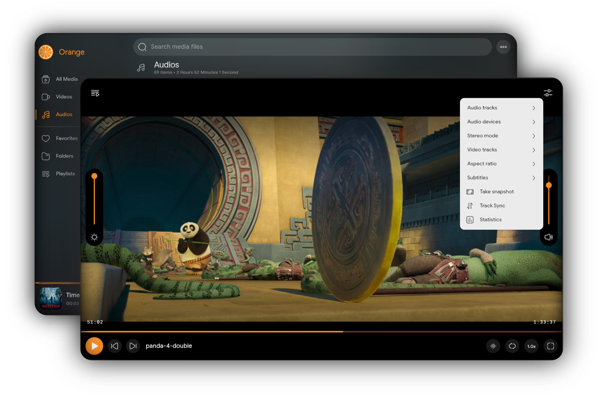

<h1 align="center">Orange Player</h1>
<h6 align="center">A Feature-rich, Beautiful desktop media player based on compose desktop, libvlc, mediainfo & ...</h6>

### 📷 Screenshot

### 🚀 Features

> - Supports many media formats
> - Search all media files in your disk
> - Extract media tags & information
> - Categorize folders and videos and audios
> - Create your playlists
> - Full-screen support
> - Equalizer support
> - Repeat modes
> - Video adjustments
> - Audio track selection
> - Video track selection
> - Load external subtitles
> - Track synchronization
> - Change audio device
> - Change audio stereo mode
> - Change playback speed
> - Drag and drop local files
> - Video snapshots
> - Volume controls
> - Aspect ratio
> - Mute
> - & ....
